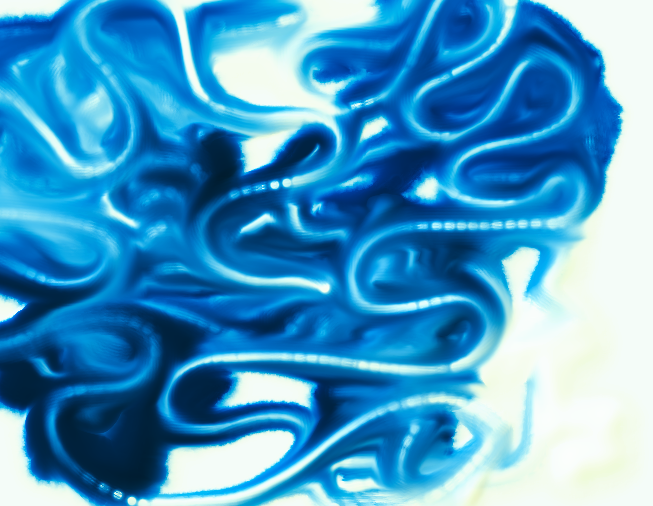
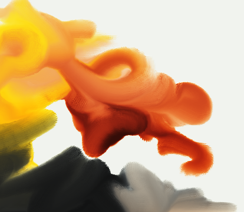
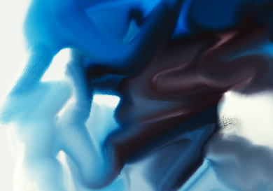

# spectral draw
 
Experimental painting app. Made with LÖVE https://love2d.org/ (required to run)

Instead of drawing in RGB, the visible spectrum is split up in 11 'bins'. This allows realistic pigment simulation. For example: blue and yellow mixing to green, very dark masstones that shift in hue and become more saturated when mixed with white.

The paint mixing is modeled using a simplified Kubelka-Munk theory. Reflectance is converted to absorbance, which mixes linearly and then converted back to reflectance when displaying. Covering power based on color and thickness is also simulated for the whole layer.

see: http://www.graphics.cornell.edu/~westin/pubs/kubelka.pdf

The spectral reflectance curves for each pigment is taken from:
https://scholarworks.rit.edu/theses/4892/

It should support tablet input on windows (using wintab driver) but this feature is experimental.

For controls see `controls.txt`.

